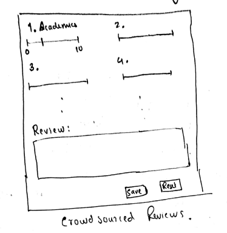

# Inter-Planetary University Ranking System
## Requirement Specification
### Informative Ranking Criterion
* Rank Universities based on criterions listed by the user. 
* The criterion can be one or more of the following
	* Region: 
		* planet, 
		* continent, 
		* country, 
		* state, 
		* district.
	* Facilities: 
		* Area: min, max _(in acres)_
		* available branches: (languages, CSE, EE, etc.)
		* available degrees: (bachelors, honors, masters, phd, etc)
	* Academics:
		* Strength of students: min, max
		* teacher student ratio
		* Faculty strength: min, max
	* International Relations:
		* ratio of international students
		* international faculty proportion
	* Placement and Industry:
		* placement details (per department)
		* Industry collaborations
	* Research:
		* no of papers per year
		* citations per faculty
	* Others:
		* Awards
		* other rankings
### Crowdsourced reviews and ratings
* People will get a link to review the universities to their email ID. 
* Same link can be used to review any number of universities. 
* One review per University per email ID. 
* No sign up required. 
* People can rate colleges on a scale of 1 to 10.
* Following criterions can be rated
	* Placement
	* Academics
	* Research
	* Interaction
	* Industry Relation
	* Facilities (Hostel, Sports, Clubs, Medical)
* An option to include or exclude these ratings while ranking. 
* A general review of the university in 600 words or less. 

## Design Documents
### The Database
* The database will be hosted on the cloud. 
* The Information table has the following signature.
```
UniversityInfo::<*ID, Name, Address, Planet, Continent, 
  Country, State, District, Website, Contact, Wikipedia, 
  Area, Strength_of_students, Faculty_strength, 
  ratio_of_international_students, list_of_available_streams, 
  placement_details, no_of_papers_per_year, citations_per_faculty, 
  international_faculty_proportion, teacher_student_ratio, 
  list_of_available_degree, etc>
```
* The Crowdsource table has the following signature.
```
CrowdSourcedInfo::<*ID, *email, Placement, Acads, Research, 
Interaction, IndustryRelation, Facilities, etc>
```
`*ed` attributes form the primary key. 
### The UI
#### Search UI
* On the left there will be a filter side bar where you can assign min, max pairs or values for search. 
* Each value will be prefilled with default values. 
* All the options will be classified into fields, and there will be a drop down menu to reveal all fields. 
* Refer diagram. 

<pre>
                                               sort by option
</pre>

<pre>
<center>Search UI design</center>
</pre>
#### Review and Rate UI
* When person opens the link from his email, he will be able to rate universities. 
* He will firstly be taken to list of universities, from there he can select the university he wants to rate. 
* The UI looks like the following. 


<pre>
<center>Slider based UI for rating Universities</center>
</pre>
### Connecting Backend and Frontend
* Appropriate functions will be provided by backend team which will be used by the frontend team to query. 
* Appropriate outputs will be provided by the the functions which will be displayed accordingly to the ui.

## Testing Documents
### Database Testing
* Unit testing of all search functions provided by the database. 
* Unit testing of all insertion functions provided by the database. 
* Attempt to modify UniversityInfo table without proper authentication. 
* SQL injection attempt
### UI Testing
#### Search part testing
* Unit testing for each filter. 
* Unit testing for combinations of filters.
* Resizing window testing
#### Crowdsourcing part testing
* Try to use an invalid link to review. 
* multiple reviews to same university by the same person
* on inserting new ratings, check if average rating updates or not
